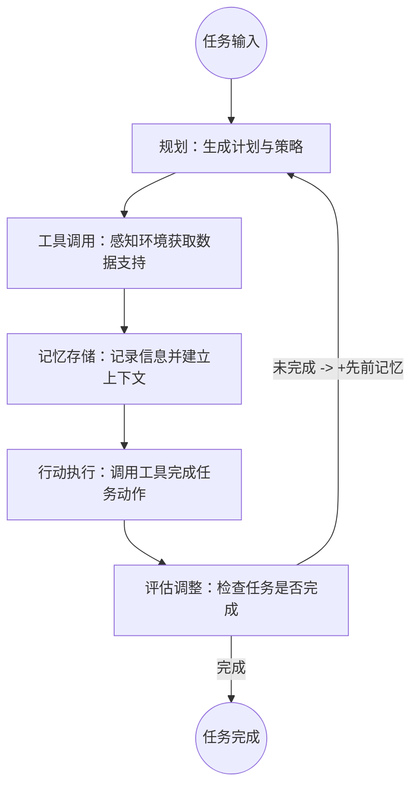

[toc]

>本文档的目的是通过一个开源的基于LLM的浏览器自动化工具`broswer-use`学习LLM Agent的相关知识，以及Agent应用的开发流程。

基于LLM的浏览器自动化工具：[browser-use](https://github.com/browser-use/browser-use)

## LLM Agent的基本模块

Agent由规划、工具、记忆与行动四大关键部分组成，分别负责任务拆解与策略评估、环境感知与决策辅助、信息存储与检索、以及将思维转化为实际行动。


Agent的基本流程：

1. **任务输入**：用户提供一个目标任务。
2. **规划**：Agent解析任务，生成初始计划和策略。
3. **工具调用**：利用工具感知环境信息，获取数据支持。
4. **记忆存储**：记录已知信息并建立关联上下文。
5. **行动执行**：根据生成的计划和环境反馈**调用工具**以执行动作。
6. **评估调整**：检验结果是否达到目标需求；如果未达成，根据现有结果重新进入**规划阶段**，调整策略，开始新一轮迭代。



## browser-use分解

源码目录：

```txt
├─browser_use
│  ├─agent
│  │  ├─message_manager
│  ├─browser
│  │  ├─tests
│  │  └─*.py
│  ├─controller
│  │  ├─registry
│  │  └─*.py
│  ├─dom
│  │  ├─history_tree_processor
│  │  │  └─*.py
│  │  ├─tests
│  │  └─*.py
│  ├─telemetry
│  │  └─*.py
|___ 其它,如example,docs,etc.
```

browser-use使用了service+views的设计，views中定义BaseModel，service实现具体逻辑。此外，使用Pydantic实现动态地扩展类是一个重要trick。

* ==== **agent**
* `browser_use.agent.prompts.SystemPrompt/AgentMessagePrompt`：定义prompt结构。传入参数后，二者通过get_system/user_message()获取结构化message。
* `browser_use.agent.views.ActionResult/AgentBrain/AgentOutput/AgentHistory/AgentHistoryList/AgentError`：利用Pydantic的BaseModel定义数据模型类，并通过Pydantic的create_model动态地扩展模型类。
  AgentBrain表示当前状态，AgentOutput描述llm应怎样输出结果，AgentHistory记录Agent历史消息。
* `browser_use.agent.service.Agent`：定义核心类Agent，其run方法是执行入口。是最上层的类，封装了Controller、MessageManager、LLM等类。
* ===== **agent/message_manager**
* `browser_use.agent.message_manager.views.ManagedMessage/MessageHistory`：定义了消息的数据模型，通过List[ManagedMessage]作为容器。
* `browser_use.agent.message_manager.service.MessageManager`：消息管理类，self.history就是MessageHistory类的实例。基本所有方法都是对self.history的操作，主要是add和remove不同类型的message，内部的核心操作是_add_message_with_tokens，提供给外部的接口是get_messages。
* ===== **controller**
* `browser_use.controller.service.Controller`：self.registry是Registry类的实例。提供multi_act和act方法，执行List[ActionModel]参数指定的行为，内部是调用了ActionRegistry的execute_action方法。
* ===== **controller/registry**
* `browser_use.controller.registry.views.RegisteredAction/ActionRegistry/ActionModel`：数据模型，分别定义已注册action的字段、管理已注册的所有actions，以及action模型。<u>RegisteredAction的param_model字段的类型是继承自ActionModel的类</u>，见@action装饰器的逻辑。
  RegisteredAction的name就是@action装饰器所装饰函数的函数名称。
* `browser_use.controller.registry.service.Registry`：action的注册类，self.registry是ActionRegistry类的实例。有一个execute_action方法通过action_name执行相应的callable。

browser-use的几个问题：

* LLM的prompt如何设计的？使得其可以对用户输入进行planning。
* 如何调用LLM，Agent核心类如何封装的？
* 如何从LLM的输出获取planning，分解并执行相应动作？
* 如何判断动作的结果是否符合预期，并判断下一步应该如何执行？
* 各步骤如何检索先前记忆并存储当前结果？

placeholder

### prompt的设计

文件在`browser_use/browser_use/agent/prompts.py`. 包含两个Prompt类，分别是SystemPrompt和AgentMessagePrompt。二者比较简单，可以看出`get_system/user_message()`方法是二者的重要方法，分别返回langchain的SystemMessage和HumanMessage。

```python
class SystemPrompt:
    def __init__(self, action_description: str, max_actions_per_step: int = 10):
        pass  # 将入参复制到self.xxx属性上
    def important_rules(self) -> str:
        pass  # 定义prompt，限制llm输出的格式以及其它说明
   	def input_format(self) -> str:
        pass  # 定义输入结构，包括当前url，现有的tabs以及可交互元素
    def get_system_message(self) -> SystemMessage:
        # 整合前面三个函数的内容并返回
        AGENT_PROMPT = f"""You are a precise browser automation agent that ...:
1. Analyze the provided webpage elements and structure
2. Use the given information to accomplish the ultimate task
3. Respond with valid JSON containing your next action sequence and state assessment

{self.input_format()}

{self.important_rules()}

Functions:
{self.default_action_description}

Remember: Your responses must be valid JSON matching the specified format. Each action in the sequence must be valid."""
        return SystemMessage(content=AGENT_PROMPT)

class AgentMessagePrompt:
    def __init__(
            self,
            state: BrowserState,
            result: Optional[List[ActionResult]] = None,
            include_attributes: list[str] = [],
            max_error_length: int = 400,
            step_info: Optional[AgentStepInfo] = None,
    ):
        pass  # 属性复制
    def get_user_message(self, use_vision: bool = True) -> HumanMessage:
        pass  # 将BrowserState转换为str，就是浏览器页面的所有元素，并作相应处理。
```

通过SystemPrompt定义好了Prompt结构，其input_format方法定义了用户输入的格式，用户输入就是将浏览器界面转换成的str类型内容。因此，AgentMessagePrompt的作用就是根据BrowserState将当前的浏览器状态转换成str类型内容。

SystemPrompt定义格式，AgentMessagePrompt将浏览器状态转换成str类型的用户输入，二者形成完整的prompt。

### Agent -- 核心类

path: `browser_use.agent.service.Agent`.

只有一个类，即Agent。其中传入的：

* llm参数是langchain的BaseChatModel，直接使用langchain实例化一个即可。
* self._setup_action_models()的作用即原理？
* telemetry属性是什么作用？不用管。
* MessageManager
* AgentHistoryList

```python
class Agent:
	def __init__(
		self,
		task: str,
		llm: BaseChatModel,
		browser: Browser | None = None,
		browser_context: BrowserContext | None = None,
		controller: Controller = Controller(),
		use_vision: bool = True,
		system_prompt_class: Type[SystemPrompt] = SystemPrompt,
		validate_output: bool = False,
		message_context: Optional[str] = None,
		sensitive_data: Optional[Dict[str, str]] = None,
		tool_call_in_content: bool = True,
		initial_actions: Optional[List[Dict[str, Dict[str, Any]]]] = None,
		tool_calling_method: Optional[str] = 'auto',
        ...
	):
        ...
        # Telemetry setup
		self.telemetry = ProductTelemetry()

		# Action and output models setup
		self._setup_action_models()  # 配置Agent的action对应的参数模型类以及AgentOutput
        
        self.tool_calling_method = self.set_tool_calling_method(tool_calling_method)

		self.message_manager = MessageManager(
			llm=self.llm,
			task=self.task,
            # 获得registry注册的所有actions的prompt描述
			action_descriptions=self.controller.registry.get_prompt_description(),
			system_prompt_class=self.system_prompt_class,
			max_input_tokens=self.max_input_tokens,
			include_attributes=self.include_attributes,
			max_error_length=self.max_error_length,
			max_actions_per_step=self.max_actions_per_step,
			message_context=self.message_context,
			sensitive_data=self.sensitive_data,
		)
        # Tracking variables
		self.history: AgentHistoryList = AgentHistoryList(history=[])
		self.n_steps = 1
```

#### 前置 -- 一些BaseModel

##### RegisteredAction & ActionRegistry & ActionModel

path: `browser_use.controller.registry.views.RegisteredAction`.

Agent中的action由name、description、function及param_model组成。

在这个例子中，RegisteredAction 模型包含一个 function: Callable 字段，Callable 是一个自定义类型（即函数类型）。默认情况下，Pydantic 不允许使用任意类型的字段，因此需要通过 arbitrary_types_allowed=True 来显式允许这种行为，以确保模型能够正确处理这些字段而不会抛出类型验证错误。

```python
class RegisteredAction(BaseModel):
	"""Model for a registered action"""

	name: str
	description: str
	function: Callable
	param_model: Type[BaseModel]

	model_config = ConfigDict(arbitrary_types_allowed=True)

	def prompt_description(self) -> str:
		"""Get a description of the action for the prompt"""
		skip_keys = ['title']
		s = f'{self.description}: \n'
		s += '{' + str(self.name) + ': '
		s += str(
			{
				k: {sub_k: sub_v for sub_k, sub_v in v.items() if sub_k not in skip_keys}
				for k, v in self.param_model.schema()['properties'].items()
			}
		)
		s += '}'
		return s
```

ActionRegistry只有一个字段actions，就是装RegisteredAction类型的Dict容器。

```python
class ActionRegistry(BaseModel):
	"""Model representing the action registry"""

	actions: Dict[str, RegisteredAction] = {}

	def get_prompt_description(self) -> str:
		"""Get a description of all actions for the prompt"""
		return '\n'.join([action.prompt_description() for action in self.actions.values()])
```

ActionModel是动态创建的，其本身定义仅包含2个方法。通过Pydantic的create_model**动态地扩展了自己**，如下：

```python
class ActionModel(BaseModel):
	"""Base model for dynamically created action models"""

	# this will have all the registered actions, e.g.
	# click_element = param_model = ClickElementParams
	# done = param_model = None
	#
	model_config = ConfigDict(arbitrary_types_allowed=True)

	def get_index(self) -> int | None:
		"""Get the index of the action"""
		# {'clicked_element': {'index':5}}
		pass

	def set_index(self, index: int):
		"""Overwrite the index of the action"""
		# Get the action name and params
		pass
```

通过create_model动态扩展：

```python
# 在browser_use.controller.registry.service.Registry.create_action_model中通过Pydantic动态地扩展自己
def create_action_model(self) -> Type[ActionModel]:
    """Creates a Pydantic model from registered actions"""
    fields = {
        name: (
            Optional[action.param_model],
            Field(default=None, description=action.description),
        )
        for name, action in self.registry.actions.items()
    }
    # fields就是动态扩展的字段，来自RegisteredAction
    return create_model('ActionModel', __base__=ActionModel, **fields)  # type:ignore
```

经动态创建后，ActionModel就有了一些字段fields。在实例化ActionModel时，就可以传入相应的参数进行初始化，Field(default=None, description=action.description)指定了默认为None。

**知识点**：通过Pydantic动态地扩展类！！！

#### Agent._setup_action_models()的作用及原理

该方法在Agent的init方法中被调用，其作用是给Agent添加action，使得Agent拥有行为能力。

```python
def _setup_action_models(self) -> None:
    """Setup dynamic action models from controller's registry"""
    # Get the dynamic action model from controller's registry
    self.ActionModel = self.controller.registry.create_action_model()
    # Create output model with the dynamic actions
    self.AgentOutput = AgentOutput.type_with_custom_actions(self.ActionModel)

def create_action_model(self) -> Type[ActionModel]:
    """Creates a Pydantic model from registered actions"""
    fields = {
        name: (
            Optional[action.param_model],
            Field(default=None, description=action.description),
        )
        for name, action in self.registry.actions.items()
    }
    ...
    return create_model('ActionModel', __base__=ActionModel, **fields)

```

从上可以得知，create_action_model的作用是根据controller.registry中已注册的actions动态生成一个Pydantic模型。具体而言，新创建的模型类名称为“ActionModel”，且继承自ActionModel，将 fields 字典中的键值对作为字段添加到新模型类中。fields 字典的键是字段名，值是字段类型和属性。

AgentOutput.type_with_custom_actions(self.ActionModel)是生成结构化的llm输出，使得llm.invoke(message)的输出是AgentOutput的实例对象：

```python
model_output = await self.get_next_action(input_messages)  # 是AgentOutput的实例对象

@time_execution_async('--get_next_action')
async def get_next_action(self, input_messages: list[BaseMessage]) -> AgentOutput:
    """Get next action from LLM based on current state"""
    ...
    structured_llm = self.llm.with_structured_output(self.AgentOutput, ...)
    response: dict[str, Any] = await structured_llm.ainvoke(input_messages)
    parsed: AgentOutput | None = response['parsed']

    if parsed is None:
        raise ValueError('Could not parse response.')
```


#### Agent.run方法

运行入口，该方法流程为：

* 如果有初始动作，则调用multi_act执行；
* 对max_steps进行迭代，每次调用该step；

```python
	@observe(name='agent.run')
	async def run(self, max_steps: int = 100) -> AgentHistoryList:
		"""Execute the task with maximum number of steps"""
		try:
			self._log_agent_run()

			# Execute initial actions if provided
			if self.initial_actions:
				result = await self.controller.multi_act(
					self.initial_actions,
					self.browser_context,
                    ...
				)
				self._last_result = result

			for step in range(max_steps):
				if self._too_many_failures():
					break

				await self.step()
                ...

			return self.history
		finally:
			...
```

step方法逻辑：

* 获取浏览器当前状态state，并将其添加到messag_manager中。
* 从message_manager中获取messages，该messages是融合了当前浏览器状态和历史状态的信息，并经过了裁剪，保证不会超过max_tokens；
* 调用get_next_action，作用就是将messages传给LLM得到model_output。由于在prompt定义了一些结构，所以LLM的输出是结构化的。
* 然后调用self.controller.multi_act(model_output.action)执行相应动作。最终是调用Registry的execute_action(action_name, ...)函数。

在执行过程中，会更新message_namager状态，保存一些信息在history。

#### Controller是如何管理并执行action的？--- by Registry类

controller的作用管理注册的action并根据action_name执行相应action。Controller只负责：

* 注册默认的actions；
* 根据ActionModel执行相应动作；

管理由Registry负责，其实注册也是由Registry负责的，通过装饰器@action实现。

```python
class Controller:
	def __init__(
		self,
		exclude_actions: list[str] = [],
		output_model: Optional[Type[BaseModel]] = None,
	):
		self.exclude_actions = exclude_actions
		self.output_model = output_model
		self.registry = Registry(exclude_actions)
		self._register_default_actions()
    def _register_default_actions(self):
        pass
    @time_execution_async('--multi-act')
	async def multi_act(
		self,
		actions: list[ActionModel],
		browser_context: BrowserContext,
		check_break_if_paused: Callable[[], bool],
		check_for_new_elements: bool = True,
		page_extraction_llm: Optional[BaseChatModel] = None,
		sensitive_data: Optional[Dict[str, str]] = None,
	) -> list[ActionResult]:
        pass
    @time_execution_sync('--act')
	async def act(
		self,
		action: ActionModel,
		browser_context: BrowserContext,
		page_extraction_llm: Optional[BaseChatModel] = None,
		sensitive_data: Optional[Dict[str, str]] = None,
	) -> ActionResult:
        pass  # 调用self.registry.execute_action()执行行为
    
```

#### Registry -- 通过装饰器进行action注册

什么是装饰器？就是一个函数f，其接收一个函数g，在f内部对g进行修改并返回。h=f(g)，h是g经过f修改的版本。

推荐视频：[【python】装饰器超详细教学，用尽毕生所学给你解释清楚，以后再也不迷茫了！_哔哩哔哩_bilibili](https://www.bilibili.com/video/BV1Gu411Q7JV?spm_id_from=333.788.videopod.sections&vd_source=266c7f8a8bf830875ba1ad6a4063e7ca).

Registry的action函数其返回一个函数decorator，decorator本身就受一个Callable，在内部经处理判断后添加到actions列表中：

```python
def action(
    self,
    description: str,
    param_model: Optional[Type[BaseModel]] = None,
):
    """Decorator for registering actions"""

    def decorator(func: Callable):
        # ...
        action = RegisteredAction(
            name=func.__name__,
            description=description,
            function=wrapped_func,
            param_model=actual_param_model,
        )
        self.registry.actions[func.__name__] = action
        return func

    return decorator
```

Registry的create_action_model是将self.registry.actions中的所有RegisteredAction当作通过Pydantic的create_model生成的新模型的字段。

```python
def create_action_model(self) -> Type[ActionModel]:
    """Creates a Pydantic model from registered actions"""
    fields = {
        name: (
            Optional[action.param_model],
            Field(default=None, description=action.description),
        )
        for name, action in self.registry.actions.items()  # 遍历self.registry.actions
    }
    ...
    return create_model('ActionModel', __base__=ActionModel, **fields)  # type:ignore
```


### MessageManager

MessageManager里面通过MessageHistory()进行管理，MessageHistory()就是一个list属性加上add和remove方法。MessageManager常用的方法是_add_message_with_tokens，最终还是调用MessageHistory的add_message方法。

```python
def _add_message_with_tokens(self, message: BaseMessage) -> None:
    """Add message with token count metadata"""

    # filter out sensitive data from the message
    if self.sensitive_data:
        message = self._filter_sensitive_data(message)

        token_count = self._count_tokens(message)
        metadata = MessageMetadata(input_tokens=token_count)
        self.history.add_message(message, metadata)
```

